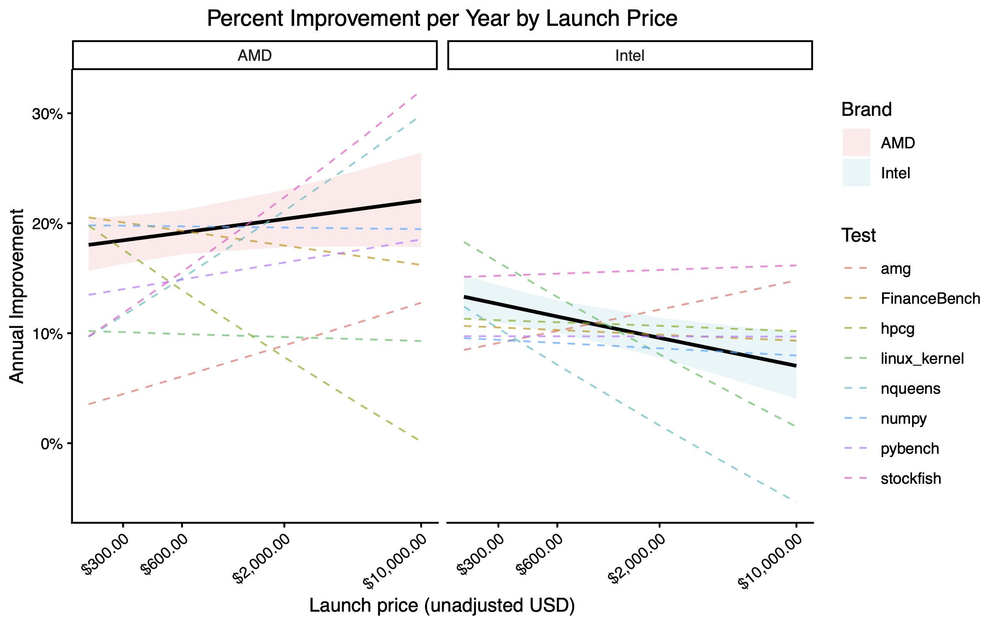

### Overview

This project estimates how fast CPU performance is actually improving for scientific and engineering workloads. Using eight benchmarks from the Phoronix Test Suite, we build a latent “general CPU performance” factor, anchor the factor scale to NumPy and AMG-style workloads for interpretability, and then fit hierarchical linear models relating this performance measure to processor launch date, price, and CPU brand. The analysis focusses on desktop and server CPUs and especially those released since 2017. We find that performance improves by roughly 10-20% per year, which corresponds to a doubling of compute approximately every 4-7 years. We observe noticeably different trajectories for AMD and Intel and variation across price segments. These findings may be useful in providing an empirically grounded way to think about when currently intractable workloads might become feasible and how long workstation-class CPU infrastructure is likely to remain competitive.

For many users, the findings are adequately summarized in this figure:

The full analysis is explained in Report.pdf.

### Replication/How to run.

The analysis files are provided in the jupyter and Rmarkdown notebooks in "modeling/". 

Run them in order: 
1. N1-Data_Cleaning.ipynb 
2. N2-Data_And_Variable_Preparation.ipynb
3. N3-Modeling.rmd

The surface plots ("images/surface_plots.png") created in the rmd file require manually saving from within Rstudio.

I do not recommend rerunning the notebook contained in the data folder titled "N0-Web_Scraping.ipynb".